# Hitalk
A IM FOR MAKING FRIEND WITH YOUR SCHOOLFELLOW

# Architecture
The project architecture is [MAL](http://www.jianshu.com/p/ae831e01dc54)

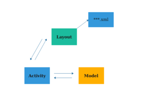

# Thanks
* [blurdialog](https://github.com/tvbarthel/BlurDialogFragment)
* [bolts-tasks](https://github.com/BoltsFramework/Bolts-Android)
* [greendao](https://github.com/greenrobot/greenDAO)
* [ninegridview](https://github.com/jeasonlzy/NineGridView)
* [photopicker](https://github.com/donglua/PhotoPicker)
* [zbar](https://github.com/ZBar/ZBar)
* [zxing](https://github.com/zxing/zxing)

# Notes for Creating an account
1. choose a string of numbers like phone number [sample：13166227158]
2. choose a school you belong [sample : 重庆邮电大学]
3. choose your Hobbies

# screencap

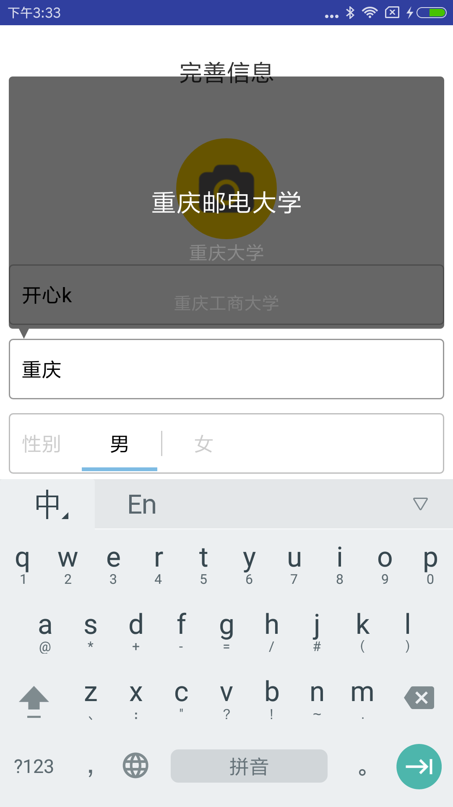
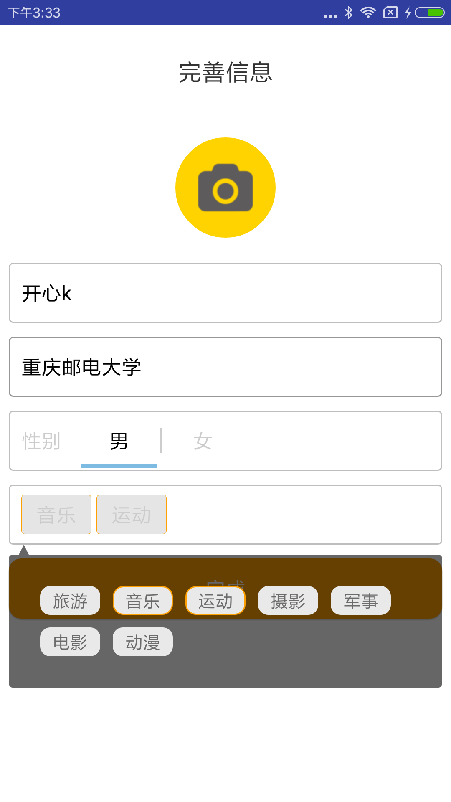
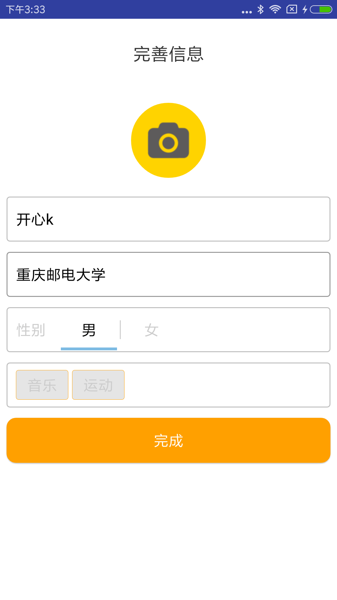
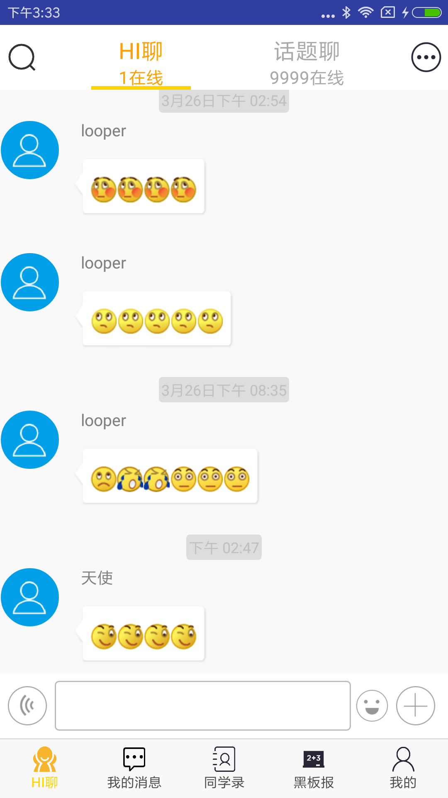
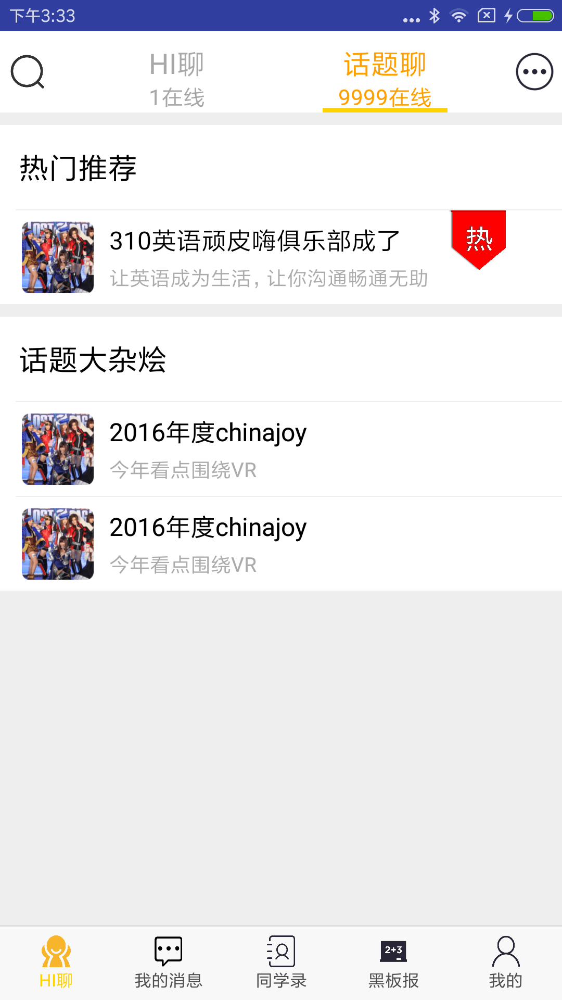

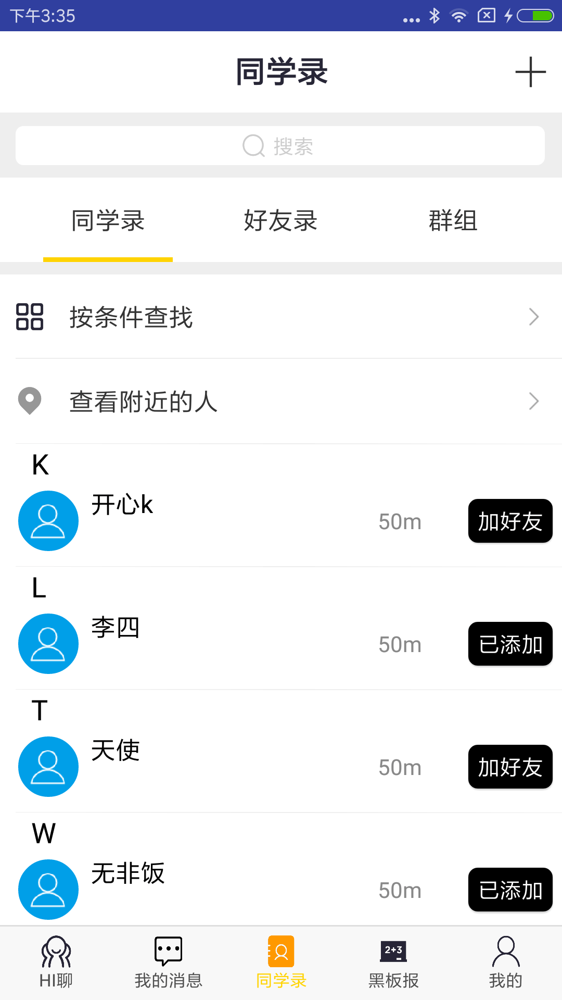
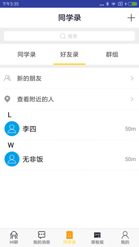

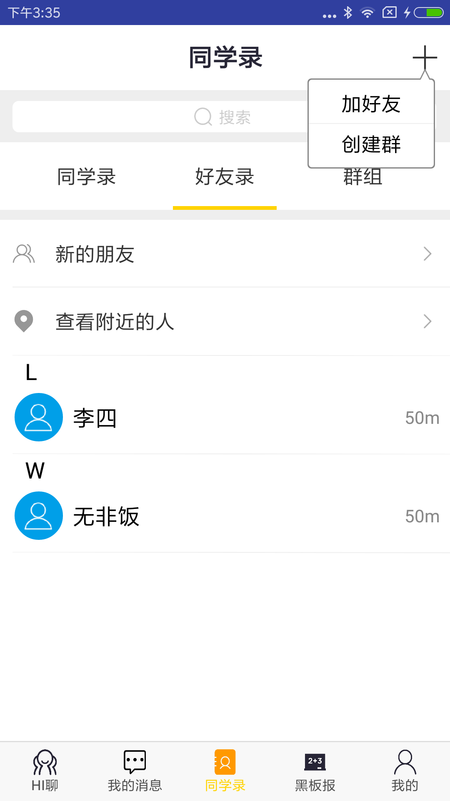

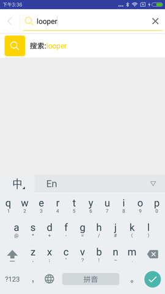

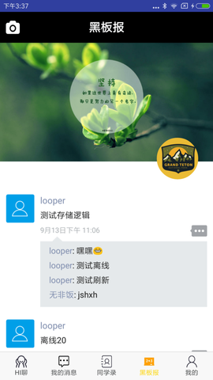
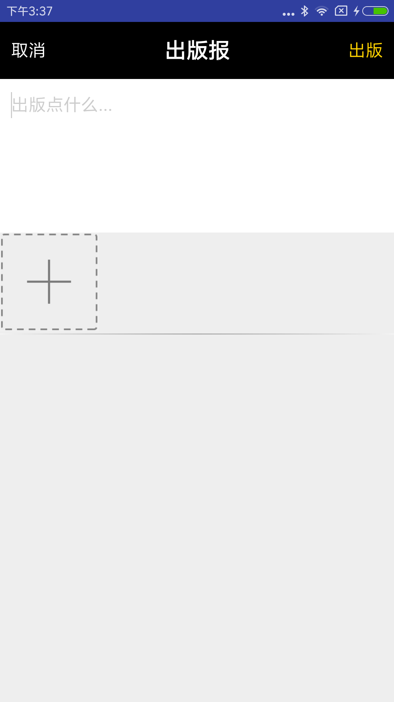
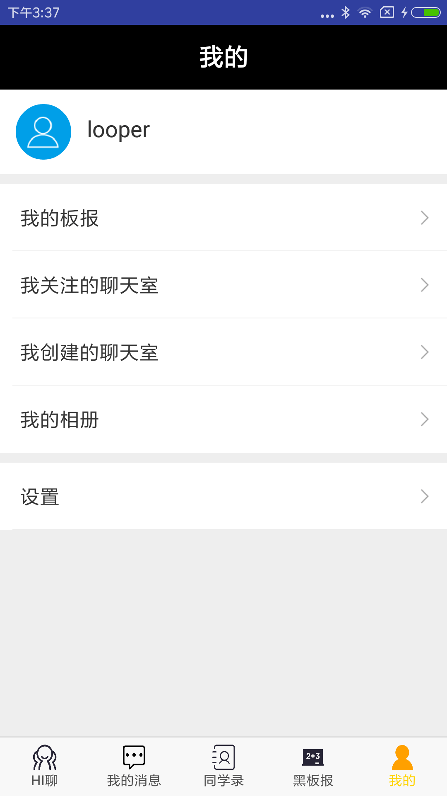

# License

   Copyright Hitalk

   Licensed under the Apache License, Version 2.0 (the "License");
   you may not use this file except in compliance with the License.
   You may obtain a copy of the License at

       http://www.apache.org/licenses/LICENSE-2.0

   Unless required by applicable law or agreed to in writing, software
   distributed under the License is distributed on an "AS IS" BASIS,
   WITHOUT WARRANTIES OR CONDITIONS OF ANY KIND, either express or implied.
   See the License for the specific language governing permissions and
   limitations under the License.